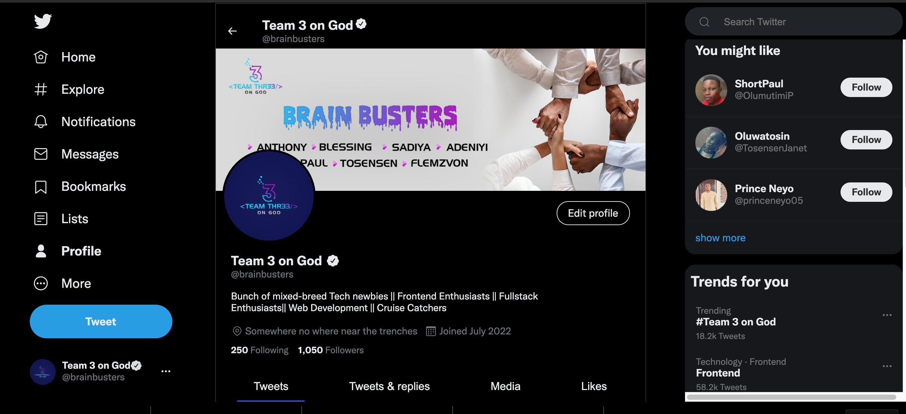
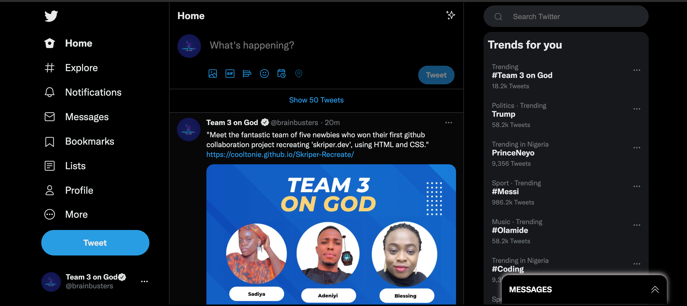
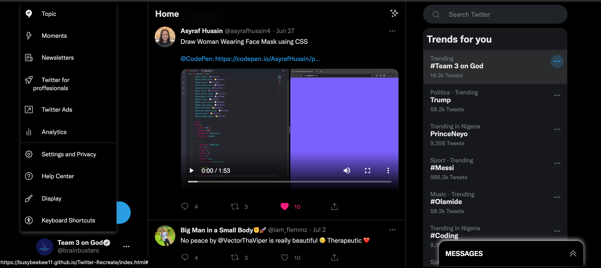
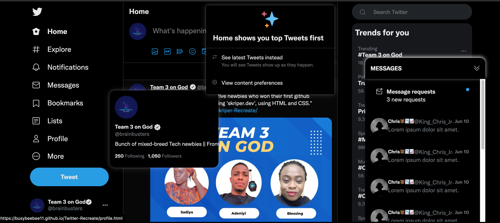
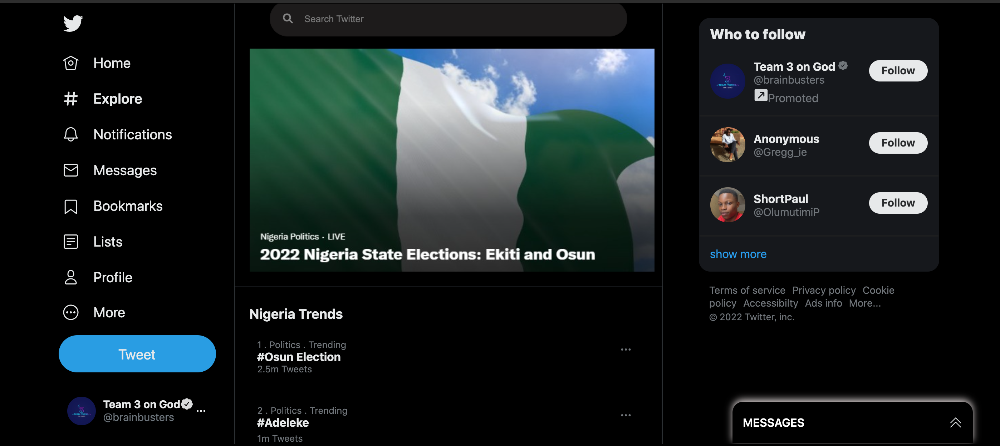
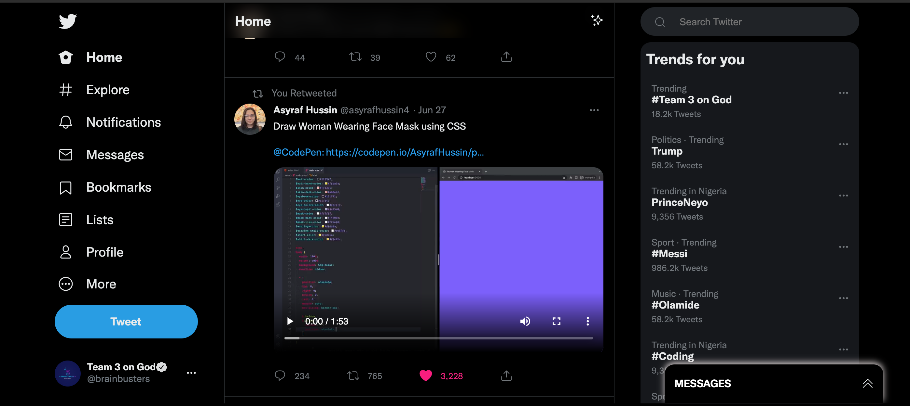
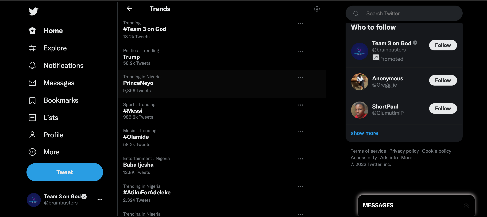
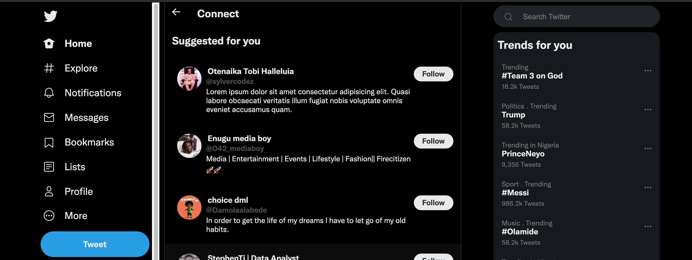

# Twitter-Recreate
Second attempt at collaboration on GitHub by a group of newbies.
___
### LANGUAGES USED
* HTML
* CSS
* Javascript
---
### RESOURCES
** twitter home page - (dummy account created)
### youtube
* [https://www.youtube.com/watch?v=aQNypoBaUNk&t=176s]
* [https://www.youtube.com/watch?v=TSsPAOmTFsM&t=368s]
* [https://www.youtube.com/watch?v=AIDiMA_C3sg]
* [https://www.youtube.com/watch?v=rGt57Hzp0FU&t=517s]
* [https://tinyurl.com/37p3w2bv]
* [https://www.w3schools.com/css/css_tooltip.asp]
* [https://www.youtube.com/watch?v=RvpYnUZRquw&t=52s]
* [https://www.w3schools.com/howto/howto_js_dropdown.asp]
### w3schools.com
---
### COLLABORATORS
* @Busybeebee11
* @Sadiya-szn
* @CoolTonie
* @PrinceNeyo
* @tosensen
* @Ayo-deji2000
---
### LIVE LINK
https://busybeebee11.github.io/Twitter-Recreate/
___

### PAGES RECREATED PREVIEW

